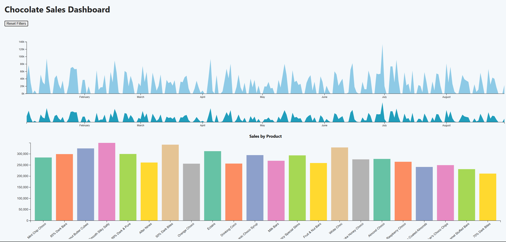
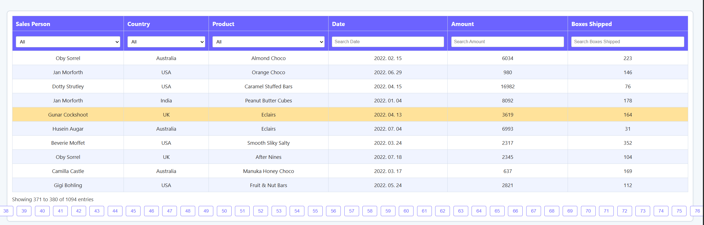

# Chocolate Sales Connected Multi-View Dashboard





## Overview

This project is an **interactive data dashboard** built with D3.js that allows users to explore chocolate sales data from Kaggle. The dashboard combines three coordinated visualization components:

- **Interactive Data Table** with filtering, sorting, and row selection
- **Time Series Area Chart** with brushing for time-range selection
- **Stacked Bar Chart** for product/category breakdown

All components are **linked**: interactions in one view update the others, enabling dynamic cross-filtering and exploration. This project demonstrates core data visualization concepts such as brushing and linking, state management, and responsive dashboard layout.

---

## Features

- **Interactive Data Table**
  - Column-based sorting (ascending/descending)
  - Per-column text filtering and dropdown filters
  - Pagination for large datasets
  - Row highlighting and selection, with visual feedback
- **Time Series Area Chart**
  - Aggregated sales over time
  - Context+focus "mini chart" with brushing to select a time range
  - Smooth transitions and responsive axes
- **Stacked Bar Chart**
  - Sales breakdown by product/category
  - Click to filter by category
  - Hover effects for emphasis
- **Brushing & Linking**
  - Selecting a time range in the area chart filters the table and bar chart
  - Selecting a category in the bar chart filters the table and area chart
  - Selecting a row in the table highlights corresponding data in the charts
- **Reset Button**
  - Clears all filters and selections, restoring the full dataset

---

## Getting Started

### Prerequisites

- [Node.js](https://nodejs.org/) (optional, for running a local server)
- [Python](https://www.python.org/) (optional, for running a local server)
- Modern web browser (Chrome, Firefox, Edge, etc.)

### Installation

1. **Clone or Download this Repository**
2. **Download the `chocolate-sales.csv` dataset** and place it in your project directory.

3. **Run a Local Web Server** (required for loading CSV data with D3):

   - Using Python:
     ```
     python -m http.server 8080
     ```
     Then open [http://localhost:8080](http://localhost:8080) in your browser.

   - Or use the [Live Server extension](https://marketplace.visualstudio.com/items?itemName=ritwickdey.LiveServer) in VS Code.

4. **Open `index.html`** in your browser via the local server.

---


